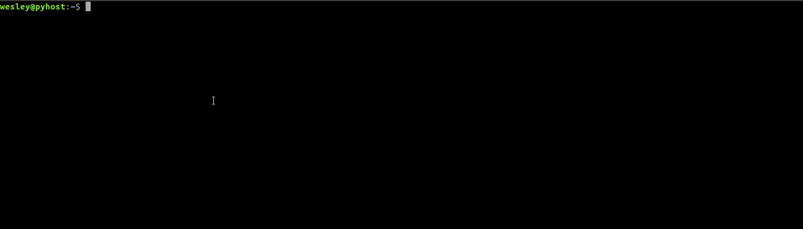

# PyTrade

> [Readme in English](README.md)

> [Readme em Português](README_PT-BR.md)

### Intro
PyTrade is a project in the context of cryptocurrency, it shows opportunities of profit presenting opportunities of execution of "arbitrage".

### Arbitrage
In the context of cryptocurrencies, arbitrage means the execution of orders such as the purchase of a certain crypto currency in exchange A, then the transfer to exchange B, so the crypto currency is sold in exchange B. The objective is to obtain profit from the price difference.

### Exchanges
- Poloniex
- Kraken
- OKCoin
- Bitstamp

### About
PyTrade connects to the exchanges' APIs, verifies prices, compares the price of the crypto-currency with other exchanges and displays the price difference, disregarding any transaction negotiation fees.

### Requirements
- Python 3.5
- Connection with the internet

### TODO
This is a simple project in its current state, it performs its purpose, however it does not have advanced features, it does not handle exceptions and it does not have error checks.

